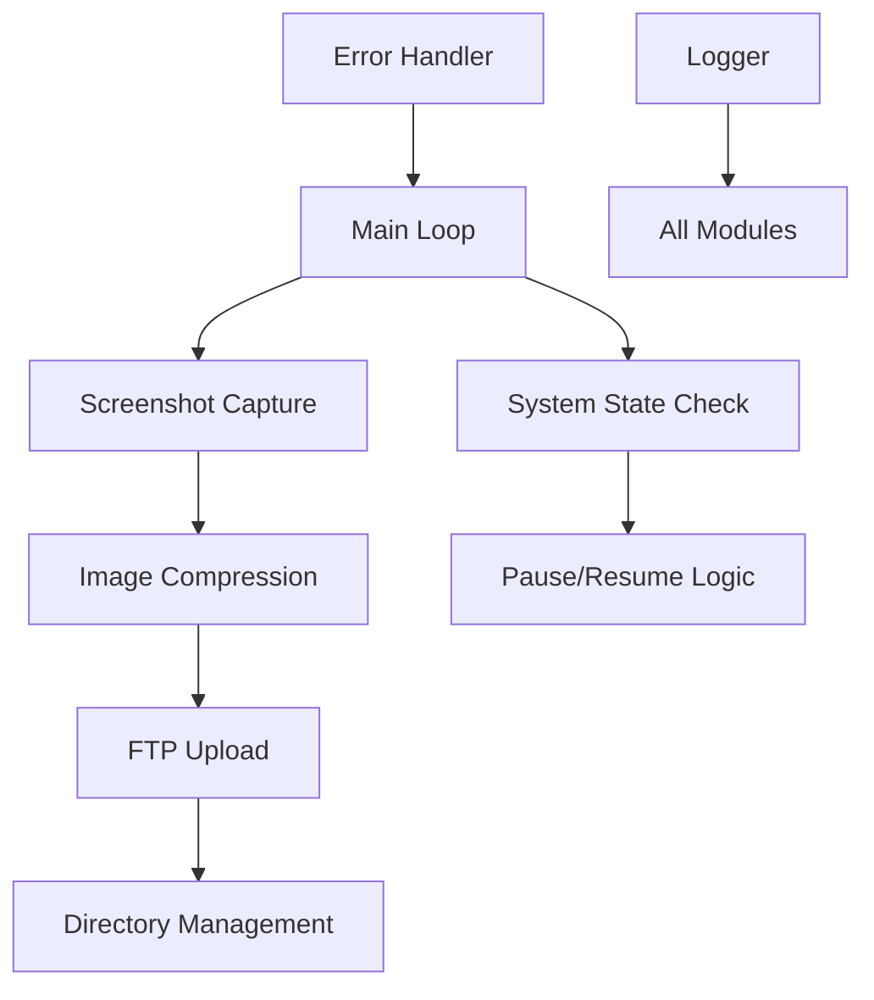

# Screenshot Capture and FTP Storage

 


## Table of Contents
- [Overview](#overview)
- [Technologies Used](#technologies-used)
- [Architecture and Design](#architecture-and-design)
- [How It Works](#how-it-works)
- [Key Features](#key-features)
- [Complexity and Uniqueness](#complexity-and-uniqueness)
- [Code Interactions](#code-interactions)
- [Setup and Installation](#setup-and-installation)
- [Configuration](#configuration)
- [Usage](#usage)
- [Deployment](#deployment)
- [Logging and Monitoring](#logging-and-monitoring)
- [Security Considerations](#security-considerations)
- [Troubleshooting](#troubleshooting)
- [License](#license)

## Overview

**Screenshot Capture and FTP Storage** is a sophisticated Python application designed to capture screenshots of an active desktop at regular intervals and automatically upload them to a remote FTP server. The application is engineered for long-term unattended operation with robust error handling, system state awareness, and intelligent resource management.

This utility is particularly useful for:
- Remote employee monitoring
- Activity logging for compliance
- System usage analytics
- Security auditing
- Time tracking applications

## Technologies Used

### Core Technologies
- **Python 3.x**: Primary programming language chosen for its cross-platform compatibility, rich ecosystem, and ease of development
- **PyAutoGUI**: Cross-platform GUI automation library for screenshot capture
- **ftplib**: Built-in Python library for FTP operations, ensuring reliability and minimal dependencies
- **psutil**: System and process utilities library for comprehensive system monitoring
- **ctypes**: Foreign function library for interfacing with Windows system APIs
- **win32 API** (Optional): Windows-specific extensions for enhanced system state detection

### Why These Technologies?
1. **Python** was selected for its simplicity, readability, and extensive standard library
2. **PyAutoGUI** provides cross-platform screenshot capabilities with minimal setup
3. **ftplib** is part of Python's standard library, eliminating external dependencies for FTP operations
4. **psutil** offers detailed system information crucial for determining system state
5. **ctypes** allows direct access to Windows APIs without requiring additional packages
6. **win32 API** provides enhanced Windows-specific functionality when available

## Architecture and Design

The application follows a modular architecture with clearly defined responsibilities:

```
Screenshot Capture and FTP Storage
├── System State Detection Module
├── Screenshot Capture Module
├── FTP Communication Module
├── Error Handling and Recovery Module
└── Logging and Monitoring Module
```

### Design Principles
- **Resilience**: The application is designed to recover from errors and continue operation
- **Resource Efficiency**: Screenshots are processed in memory without unnecessary disk I/O
- **Security Awareness**: Operation pauses when system is locked to respect user privacy
- **Long-term Operation**: Built to run continuously for extended periods (up to 7 months)

## How It Works

### Step-by-Step Process

1. **Initialization**
   - Configure logging to file for monitoring and debugging
   - Set up FTP connection parameters
   - Determine user context for folder organization

2. **System State Monitoring**
   - Continuously check if the system is locked using multiple detection methods
   - Pause operations when system is locked to respect user privacy
   - Resume when system becomes active again

3. **Screenshot Capture**
   - Capture full desktop screenshot using PyAutoGUI
   - Compress image to JPEG format with 50% quality to reduce bandwidth
   - Store in memory buffer (no temporary files created)

4. **Filename Generation**
   - Create timestamp-based filenames with format: `YYYY-MM-DD-(HH-MM-SS).jpg`
   - Organize files in a hierarchical directory structure: `/username/YYYY-MM-DD/`

5. **FTP Upload Process**
   - Establish secure connection to FTP server
   - Navigate to or create user-specific directory
   - Navigate to or create date-specific subdirectory
   - Upload compressed screenshot directly from memory buffer

6. **Loop Management**
   - Wait 10 seconds between captures to balance frequency and resource usage
   - Handle errors gracefully with automatic retry mechanisms
   - Continue operation for up to 7 months before automatic termination

## Key Features

### Intelligent System State Detection
- Multi-method system lock detection using:
  - Window handle analysis via ctypes
  - Process scanning for LogonUI.exe
  - Fallback mechanisms for different Windows versions

### Memory-Optimized Processing
- Screenshots processed entirely in memory
- No temporary files created, reducing disk I/O
- JPEG compression with configurable quality (currently 50%)

### Robust Error Handling
- Automatic retry mechanisms for network failures
- Graceful degradation when optional modules are unavailable
- Comprehensive logging for troubleshooting

### Hierarchical Storage Organization
- Automatic folder creation based on:
  - Username for multi-user environments
  - Date for chronological organization
  - Time for precise identification

### Long-term Unattended Operation
- Designed for 7-month continuous operation
- Automatic restart on critical failures
- Resource cleanup to prevent memory leaks

## Complexity and Uniqueness

### Technical Complexity
1. **Multi-layered System Detection**: Uses three different methods to detect system lock state
2. **Memory Management**: Processes images entirely in memory without temporary files
3. **Error Resilience**: Implements multiple fallback mechanisms for continued operation
4. **Cross-Platform Considerations**: Uses both standard libraries and Windows-specific APIs

### Unique Features
1. **Privacy-First Approach**: Automatically pauses when system is locked
2. **Hierarchical Organization**: Automatically creates logical folder structure on FTP server
3. **Extended Operation**: Designed for 7-month continuous operation
4. **Self-Healing**: Automatically recovers from most errors without user intervention

## Code Interactions

### Module Interactions


### Data Flow
1. **Configuration Data**: FTP credentials and paths flow from constants to connection module
2. **System State**: Lock detection results influence capture/upload decisions
3. **Image Data**: Screenshots flow from capture → compression → upload with no intermediate storage
4. **Logging Data**: All operations are logged for monitoring and debugging

## Setup and Installation

### Prerequisites
- Windows operating system (7/8/10/11)
- Python 3.6 or higher
- Internet connectivity for FTP operations
- FTP server with write permissions

### Installation Steps

1. **Clone the Repository**
   ```bash
   git clone https://github.com/your-username/Screenshot-Capture-and-FTP-Storage.git
   cd Screenshot-Capture-and-FTP-Storage
   ```

2. **Install Required Dependencies**
   ```bash
   pip install pyautogui psutil
   ```

3. **Optional Windows Extensions** (for enhanced lock detection)
   ```bash
   pip install pywin32
   ```

### System Requirements
- **RAM**: Minimum 512MB (recommended 1GB)
- **Disk Space**: Minimal (no temporary files)
- **Network**: Stable internet connection for FTP uploads
- **Permissions**: Desktop capture permissions

## Configuration

### FTP Configuration
Edit the following variables in [screenshot_to_ftp.py](screenshot_to_ftp.py):

```python
ftp_host = "your_ftp_server_ip_or_hostname"
ftp_user = "your_ftp_username"
ftp_password = "your_ftp_password"
ftp_base_directory = "/screenshots_or_your_preferred_directory"
```

### Duration Configuration
The application runs for 7 months by default. To modify this:

```python
SEVEN_MONTHS_SECONDS = desired_duration_in_seconds
```

### Quality Configuration
Adjust JPEG compression quality (1-100):

```python
screenshot.save(img_byte_arr, format="JPEG", quality=50)  # 50 is current value
```

## Usage

### Running the Application
```bash
python screenshot_to_ftp.py
```

### Running as Background Process
```bash
pythonw screenshot_to_ftp.py  # Windows only, no console window
```

### Creating Executable
Using PyInstaller:
```bash
pip install pyinstaller
pyinstaller screenshot_to_ftp.spec
```

The executable will be created in the `dist` folder.

## Deployment

### Windows Deployment Options

1. **Direct Python Execution**
   - Install Python on target machine
   - Install dependencies
   - Run script directly

2. **Executable Deployment**
   - Use provided spec file to create executable
   - Distribute single executable file
   - No Python installation required on target

3. **Scheduled Task Deployment**
   ```powershell
   # Create scheduled task to run at system startup
   schtasks /create /tn "ScreenshotCapture" /tr "C:\path\to\screenshot_to_ftp.exe" /sc onstart /ru System
   ```

### Multi-user Considerations
- Each user's screenshots are stored in separate folders
- Username automatically detected using `os.getlogin()`
- Concurrent execution supported for different users

## Logging and Monitoring

### Log File Location
Logs are stored in `screenshot_log.txt` in the same directory as the script.

### Log Levels
- **INFO**: Normal operation events
- **WARNING**: Non-critical issues (system locked, etc.)
- **ERROR**: Recoverable errors (network issues, etc.)
- **CRITICAL**: Application-level failures

### Log Rotation
Currently, logs are not automatically rotated. For production use, consider implementing:
```python
from logging.handlers import RotatingFileHandler

handler = RotatingFileHandler('screenshot_log.txt', maxBytes=1024*1024, backupCount=5)
```

## Security Considerations

### Data Security
- Screenshots are processed in memory (no disk storage)
- JPEG compression reduces data size for transmission
- No local caching of sensitive information

### Credential Security
- FTP credentials stored in plain text in the script
- For production, consider:
  ```python
  import getpass
  ftp_password = getpass.getpass("FTP Password: ")
  ```
  or environment variables:
  ```python
  import os
  ftp_password = os.environ['FTP_PASSWORD']
  ```

### Privacy Protection
- Automatic pause when system is locked
- No capture during user inactivity
- Clear folder organization by user and date

## Troubleshooting

### Common Issues

1. **Permission Errors**
   - Ensure script has desktop capture permissions
   - Run as administrator if needed
   - Check Windows security settings

2. **FTP Connection Failures**
   - Verify FTP server address and credentials
   - Check firewall settings
   - Confirm network connectivity

3. **System Detection Issues**
   - Install pywin32 for better lock detection
   - Check Windows version compatibility
   - Review log files for detection errors

4. **Memory Issues**
   - Monitor system resources
   - Restart application periodically if needed
   - Check for memory leaks in logs

### Log Analysis
Check `screenshot_log.txt` for:
- Connection errors
- Authentication failures
- System lock events
- Upload successes/failures

### Debug Mode
Enable detailed logging by modifying:
```python
logging.basicConfig(
    level=logging.DEBUG,  # Change from logging.INFO
    # ... rest of configuration
)
```

## License

This project is licensed under the MIT License - see the LICENSE file for details.

MIT License

Permission is hereby granted, free of charge, to any person obtaining a copy
of this software and associated documentation files (the "Software"), to deal
in the Software without restriction, including without limitation the rights
to use, copy, modify, merge, publish, distribute, sublicense, and/or sell
copies of the Software, and to permit persons to whom the Software is
furnished to do so, subject to the following conditions:

The above copyright notice and this permission notice shall be included in all
copies or substantial portions of the Software.

THE SOFTWARE IS PROVIDED "AS IS", WITHOUT WARRANTY OF ANY KIND, EXPRESS OR
IMPLIED, INCLUDING BUT NOT LIMITED TO THE WARRANTIES OF MERCHANTABILITY,
FITNESS FOR A PARTICULAR PURPOSE AND NONINFRINGEMENT. IN NO EVENT SHALL THE
AUTHORS OR COPYRIGHT HOLDERS BE LIABLE FOR ANY CLAIM, DAMAGES OR OTHER
LIABILITY, WHETHER IN AN ACTION OF CONTRACT, TORT OR OTHERWISE, ARISING FROM,
OUT OF OR IN CONNECTION WITH THE SOFTWARE OR THE USE OR OTHER DEALINGS IN THE
SOFTWARE.
